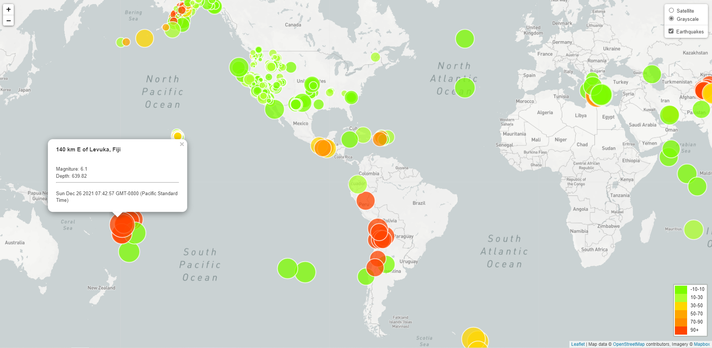
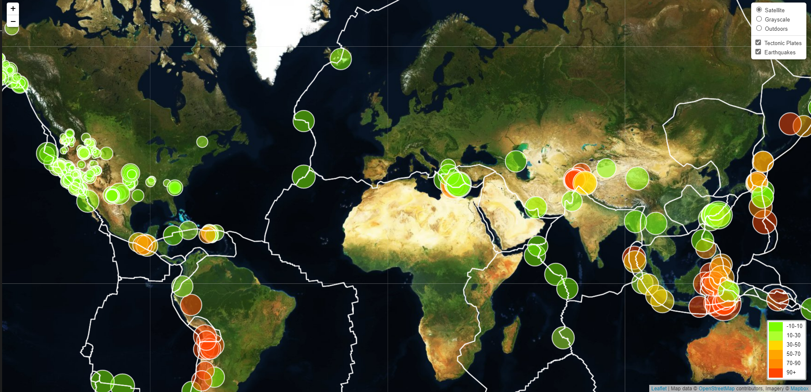

# leaflet-challenge

As part of the learning exercise, I have considered the Earthquake data for past 7 days from United States Geological Survey (USGS). For reference the map provides, Earthquakes' Magniture, Depth and the location. 

Using the MapBox (<https://www.mapbox.com/>) maps for views like Satellite, Grayscale and Outdoors, we can see the earthquakes around the world.

Also, as additional step, I have sourced the coordinates of tectonic plates (from <https://github.com/fraxen/tectonicplates>), and plotted them on top of this map. This helps observe if the earthquake center is close to the tectonic plates.

